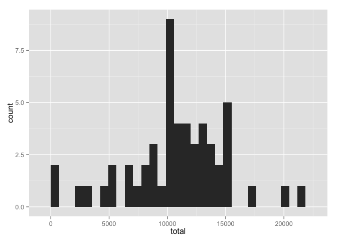
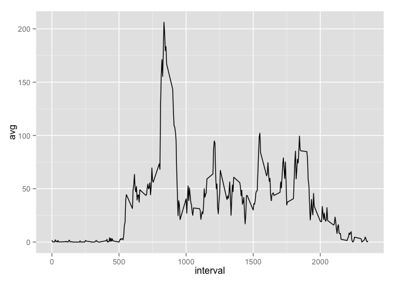
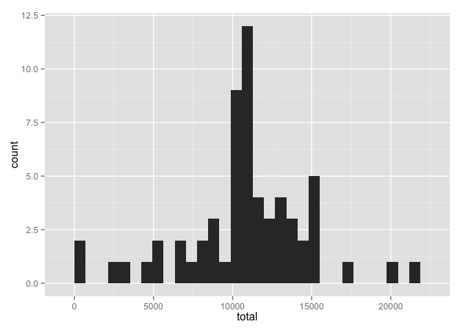
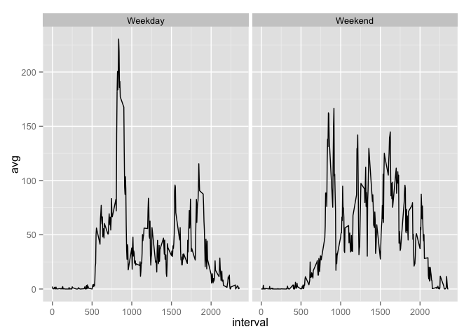

# Reproducible Research: Peer Assessment 1

## Loading and preprocessing the data


```r
unzip("activity.zip") #unzips into working directory
activity <- read.csv("activity.csv")

library(lubridate)
activity$date <- ymd(activity$date)
```

## What is mean total number of steps taken per day?


```r
library(dplyr)
```

```
## 
## Attaching package: 'dplyr'
## 
## The following objects are masked from 'package:lubridate':
## 
##     intersect, setdiff, union
## 
## The following objects are masked from 'package:stats':
## 
##     filter, lag
## 
## The following objects are masked from 'package:base':
## 
##     intersect, setdiff, setequal, union
```

```r
library(ggplot2)

activity %>%
    group_by(date) %>%
    summarise(total = sum(steps)) -> per_day

ggplot(per_day) + geom_histogram(aes(x = total))
```

```
## stat_bin: binwidth defaulted to range/30. Use 'binwidth = x' to adjust this.
```

 

```r
step_mean <- mean(per_day$total, na.rm = TRUE)
step_medn <- median(per_day$total,na.rm = TRUE)
```

The mean number of steps taken daily was 1.0766189\times 10^{4}. The median value was 10765. 

## What is the average daily activity pattern?


```r
activity %>%
    group_by(interval) %>%
    summarise(avg = mean(steps, na.rm = TRUE)) -> avg_day

ggplot(avg_day) + geom_line(aes(x = interval, y = avg))
```

 

```r
max_interval <- avg_day$interval[which.max(avg_day$avg)]
```

The interval with the most number of steps (on average) was 835.


## Imputing missing values


```r
#Calculate and report the total number of missing values in the dataset (i.e. the total number of rows with NAs)

number_NAs <- sum(is.na(activity$steps)) # the output of summary says that steps is the only column with NAs
```

The number of missing values in the dataset is 2304.


```r
# determine average for the interval and replace NAs with the corresponding value

# average per interval is found in avg_day

NA_index <- is.na(activity$steps) # helps split object

activity_NAs <- activity[NA_index,] # this is the object with only NAs
activity_complete <- activity[!NA_index,] # this is object that doesn't need to be touched

activity_NAs %>%
    left_join(avg_day) -> activity_NAs_2  # bring in average interval values
```

```
## Joining by: "interval"
```

```r
activity_NAs_2 <- activity_NAs_2[,c(4,2,3)] # change column order
names(activity_NAs_2)[1] <- "steps"  # change new column name

activity_imputted <- rbind(activity_NAs_2, activity_complete) # this has no missing values
```


```r
activity_imputted %>%
    group_by(date) %>%
    summarise(total = sum(steps)) -> per_day_imputted

ggplot(per_day_imputted) + geom_histogram(aes(x = total))
```

```
## stat_bin: binwidth defaulted to range/30. Use 'binwidth = x' to adjust this.
```

 

```r
step_mean_imput <- mean(per_day_imputted$total, na.rm = TRUE)
step_medn_imput <- median(per_day_imputted$total,na.rm = TRUE)
```

Once we correct for the missing values, the mean number of steps taken daily was 1.076619\times 10^{4}. The median value was 1.076619\times 10^{4}. This is very little difference for the mean value, but a 1.19 for the median estimate.


## Are there differences in activity patterns between weekdays and weekends?


```r
activity_imputted %>%
    mutate(dayofweek = wday(date),       # lubridate version is easier
           end = factor(ifelse(dayofweek %in% c(1,7), "Weekend","Weekday"))) %>%
    group_by(end, interval) %>%
    summarise(avg = mean(steps, na.rm = TRUE)) -> activity_imputted

ggplot(activity_imputted) + geom_line(aes(x = interval, y = avg)) + facet_wrap(~end)
```

 


